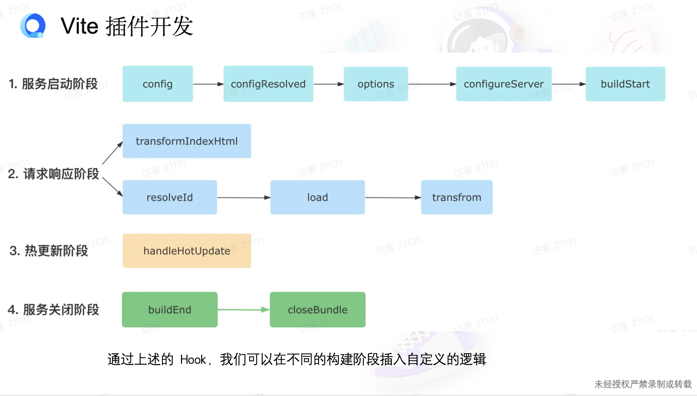

# Webpack, Vite

## Webpack

Loader

为了处理非标准JS资源，设计出资源翻译模块。

⇒ 用于将资源翻译为标准JS

Plugins

hooks

## Vite

1. No-bundle开发服务 源文件无需打包
2. 生产环境基于Rollup的bundler

特征

高性能 dev启动和热更新更快

简单易用 开发体验好

两大行业趋势

1 全球浏览器对原生esm的普遍支持
```
<script type=”module”>
```

原生语言（Go、Rust）编写前端编译工具链

例如Go编写的Esbuild Rust编写的swc（对标babel）

vite本质 开发时的dev Server 接受浏览器的请求，进行文件编译、内容响应，让浏览器最后拿到需要的js。这属于基于原生esm的开发服务

基于原生esm的开发服务优势：

1. 无需打包项目源代码（去除了bundler的开销
2. 天然的按需加载
3. 利用文件级别的浏览器缓存

vite开箱即用的功能包括：

webpack

webpack-dev-server

css-loader style-loader less- sass- postcss-

file-loader

MiniCssExtractPlugin

HTMLWebpackPlugin

** React 中 module.css 做到不同组件间的样式隔离

vite的hmr是可以保存组件状态的

Vite

Tree Shaking的优化原理

1. 基于esm的import/export语句依赖 与运行时状态无关

1. 在构建阶段将未使用到的代码进行删除

Vite中TreeShaking默认开启

开发环境

## Vite的重要细节

### 1. 开发环境的依赖预打包

因为node_modules不可控，

- 有些包引入了很多（6-700个）其他的库
- 有的库是用commonJs写的，require(xxx)这种放到浏览器就跑不起来了

所以扫描一下node_modules，对依赖的代码采用es6进行预打包。

改写业务代码中import的路径。例如react路径就被打包出预产物的路径

### 2. 单文件的编译：Esbuild进行编译

优势：编译速度提升10-100x

局限：

es6不支持类型检查（所以build的命令里 需要先tsc进行类型检查）

```json
    "build": "tsc && vite build",
```

不支持语法降级到ES5（eg低端手机端浏览器

### 3. 代码压缩

Esbuild作为默认压缩工具，提升传统开发工具

## Vite插件机制

开发阶段：模拟Rollup插件机制

开发环境：直接用Rollup

（但是不是所有的Rollup插件都可以兼容vite）

## Vite进阶路线

### 1. Vite底层非常依赖的双引擎

Esbuild官方文档

Rollup官方文档

推荐学习顺序：1 基本使用 动手尝试各项常用配置 2 学习其插件开发

### 2. Vite的插件开发

1. 让构建和devServe解耦
2. 易于拓展



推荐：（开发插件必须要用到的四个hooks）

服务启动阶段：config

请求响应阶段：resolveId，load，transform


代码分割（拆包）

以前前端工程只打出一个bundler：

- 这样不能利用浏览器并发请求
- 缓存复用率低

vite的拆包很依赖rollup的代码分割